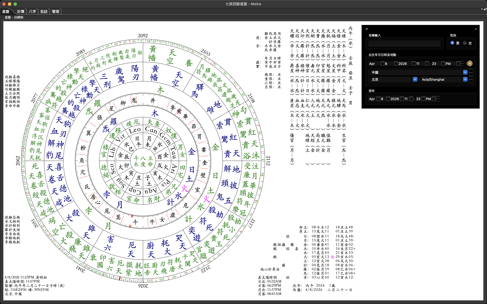

简体中文 | [English](./README.en.md)

# Moira for macOS Apple Silicon

把一套老牌的 Moira Java/SWT 桌面程序，认真整理成今天的 Apple Silicon Mac 还能直接下载安装、稳定打开、继续维护的样子。

This repository turns the classic Moira Java/SWT desktop app into something you can still install, launch, and maintain comfortably on today's Apple Silicon Macs.

## 这是什么 / What This Is

如果你只是想在 M 系列 Mac 上把 Moira 安安稳稳装起来，这个仓库就是给你准备的。

If all you want is a dependable Moira build for an M-series Mac, this repository is meant for exactly that.

如果你还想继续维护源码，它也把开发链路一并整理好了，不需要再去拼凑一堆零散环境。

If you also want to keep hacking on the code, the source build and packaging flow are here too, instead of living in scattered one-off machine setups.

最新 Release 里除了 macOS 的 `Moira-*.dmg` 和 `Moira.app.zip`，也一并放了 Windows 安装包 `Moira-jre.exe`，方便不同系统的用户直接找到可下载版本。

Besides the macOS `Moira-*.dmg` and `Moira.app.zip`, the latest release also includes the Windows installer `Moira-jre.exe` so users on either platform can find a download more easily.

## 这个仓库补上的，不只是“能跑” / What This Repository Adds

这里做的事情，核心不是把工程勉强从 IDE 里点亮，而是把它整理成一个更像真正桌面软件的发布仓库。

The point here is not merely getting the project to open in an IDE, but turning it into something that behaves like a real desktop release.

- 恢复了角距标注线功能，同时绕开现代 macOS 上容易把 SWT 绘图路径搞崩的 XOR 即时绘制方式。
- 高分屏模式不再糊成一片，Retina 下的图盘渲染清楚很多。
- 右侧日期、时间、地点输入区重新做了不透明和对比度处理，不会再漂在盘面上看不清。
- 运行时读写路径分离，签名后的 `.app` 不需要再往自己包内写数据。
- 开发构建、App 打包、图标转换、签名、公证这几条链都整理成了脚本。

- Aspect marker overlays are back, without using the crash-prone SWT XOR drawing path on modern macOS.
- HiDPI rendering is much cleaner on Retina displays.
- The right-side date, time, and location panel is readable again instead of fading into the chart.
- Runtime reads and writes are separated so the signed `.app` does not try to mutate its own bundle.
- Build, icon, packaging, signing, and notarization steps are scripted instead of being tribal knowledge.

## 先从哪里开始 / Where To Start

### 普通使用 / For End Users

如果你只是想下载安装：去 [Latest Release](https://github.com/Horace-Maxwell/Moira_APP_MacOS_ARM/releases/latest)。macOS 用户可以下载 `Moira-*.dmg` 或 `Moira.app.zip`；Windows 用户可以直接下载 `Moira-jre.exe`。

If you just want to install it: head to [Latest Release](https://github.com/Horace-Maxwell/Moira_APP_MacOS_ARM/releases/latest). macOS users can choose `Moira-*.dmg` or `Moira.app.zip`, while Windows users can download `Moira-jre.exe` directly.

### 开发维护 / For Developers

如果你要编译源码：先看 [README.zh-CN.md](./README.zh-CN.md) 或 [README.en.md](./README.en.md)。源码兼容目标还是 Java 11，开发入口也已经整理好了。

If you want to build from source: start with [README.zh-CN.md](./README.zh-CN.md) or [README.en.md](./README.en.md). The source compatibility target is still Java 11, and the development entry points are already documented.

## 仓库里这些文件值得先看 / Files Worth Opening First

- [README.zh-CN.md](./README.zh-CN.md): 中文完整说明，适合直接跟着做。 English: the full Chinese guide if you want the most complete walkthrough first.
- [README.en.md](./README.en.md): 英文构建与打包说明。 English: the dedicated English build and packaging guide.
- [docs/releases/v1.50.1.md](./docs/releases/v1.50.1.md): 这一版发布改了什么，适合快速浏览。 English: a compact release note for this version.
- [scripts/build-dev.sh](./scripts/build-dev.sh): 本地开发构建和直接启动。 English: build locally and launch the app from source.
- [scripts/package-macos.sh](./scripts/package-macos.sh): `.app` / `.dmg` 打包，以及签名、公证入口。 English: package the macOS app and run signing or notarization.
- [scripts/make-icns.sh](./scripts/make-icns.sh): 旧图标转 macOS `.icns`。 English: convert the legacy icon into a macOS `.icns`.
- [CONTRIBUTING.md](./CONTRIBUTING.md): 如果你准备提改动，先看这个会省很多来回沟通。 English: contribution expectations and workflow.
- [CODE_OF_CONDUCT.md](./CODE_OF_CONDUCT.md): 社区协作约定。 English: community conduct guidelines.
- [SECURITY.md](./SECURITY.md): 安全问题反馈方式。 English: where and how to report security issues.

## 项目来源 / Project Lineage

原始桌面程序来自 At Home Projects。

The original desktop application was created by At Home Projects.

Apple Silicon 源码整理和 IntelliJ IDEA 可运行基础来自 [tutorial0/moira_macOS](https://github.com/tutorial0/moira_macOS)。这里也特别感谢这个仓库的贡献: 它保留了 Apple Silicon 下第一版真正可运行、可调试的工程基础，让后续的修复、打包、发布和长期维护都有了可靠起点。

The Apple Silicon source-tree preservation and IntelliJ-friendly setup came from [tutorial0/moira_macOS](https://github.com/tutorial0/moira_macOS). Special thanks to that repository for providing the first practical, debuggable base on Apple Silicon, which made the later fixes, packaging, release work, and long-term maintenance possible.

## 技术范围 / Technical Scope

- 目标平台：macOS on Apple Silicon (`arm64`)
- 源码兼容目标：Java 11
- 桌面 UI 栈：Java + SWT
- 发布产物：签名的 `Moira.app`、公证过的 `.dmg`，以及一并提供在 Release 里的 `Moira-jre.exe`
- 用户可写目录：`~/Library/Application Support/Moira`

- Target platform: macOS on Apple Silicon (`arm64`)
- Source compatibility target: Java 11
- Desktop UI stack: Java + SWT
- Release artifacts: signed `Moira.app`, notarized `.dmg`, plus `Moira-jre.exe` published alongside them in the release assets
- User-writable directory: `~/Library/Application Support/Moira`

## 许可证 / License

目前根目录只保留主许可证 [`LICENSE`](./LICENSE)，沿用历史 Moira 的 GPL 文本。

The repository root now keeps a single main license entry, [`LICENSE`](./LICENSE), which preserves the historical Moira GPL text.

第三方许可证说明单独放在 [docs/licenses/LGPL-2.1.txt](./docs/licenses/LGPL-2.1.txt) 和 [docs/licenses/Swiss-Ephemeris-SEPL-0.2.txt](./docs/licenses/Swiss-Ephemeris-SEPL-0.2.txt)。

Third-party license notices are kept separately in [docs/licenses/LGPL-2.1.txt](./docs/licenses/LGPL-2.1.txt) and [docs/licenses/Swiss-Ephemeris-SEPL-0.2.txt](./docs/licenses/Swiss-Ephemeris-SEPL-0.2.txt).
